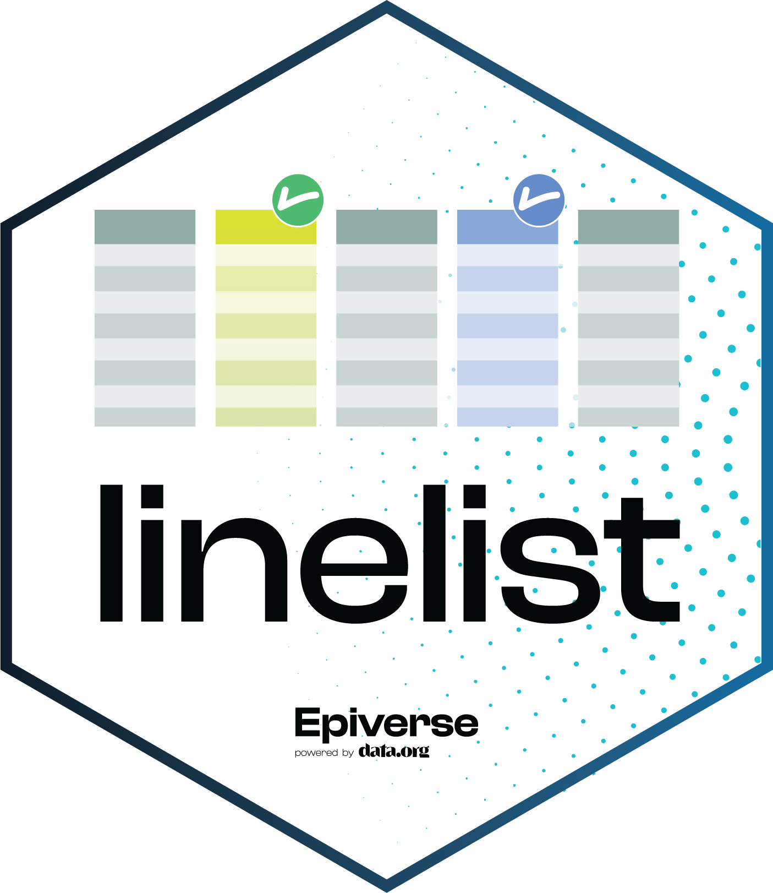

<!-- README.md is generated from README.Rmd. Please edit that file -->

```{r readmesetup, include = FALSE}
knitr::opts_chunk$set(
  collapse = TRUE,
  comment = "#>",
  fig.path = "man/figures/README-",
  out.width = "100%"
)
```


# *linelist*: Tagging and Validating Epidemiological Data 

<!-- badges: start -->

[](https://digitalpublicgoods.net/registry/linelist.html)
[](https://opensource.org/licenses/MIT)
[](https://cran.r-project.org/web/checks/check_results_linelist.html)
[](https://github.com/epiverse-trace/linelist/actions)
[](https://codecov.io/gh/epiverse-trace/linelist)
[](https://www.reconverse.org/lifecycle.html#experimental) 
[](https://cran.r-project.org/package=linelist)
[](https://cran.r-project.org/package=linelist)
[](https://doi.org/10.5281/zenodo.6556047)

<!-- badges: end -->


*linelist* provides a safe entry point to the *Epiverse* software ecosystem,
adding a foundational layer through *tagging*, *validation*, and *safeguarding*
epidemiological data, to help make data pipelines more straightforward and
robust.


## Installation

### Stable version

Our stable versions are released on CRAN, and can be installed using:

```{r, eval=FALSE}
install.packages("linelist", build_vignettes = TRUE)
```

### Development version

The development version of *linelist* can be installed from
[GitHub](https://github.com/) with:

```{r, eval=FALSE}
if (!require(remotes)) {
  install.packages("remotes")
}
remotes::install_github("epiverse-trace/linelist", build_vignettes = TRUE)
```


## Usage


*linelist* works by tagging key epidemiological data in a `data.frame` or a
`tibble` to facilitate and strengthen data pipelines. The resulting object is a
`linelist` object, which extends `data.frame` (or `tibble`) by providing three
types of features:

1. a **tagging system** to identify key data, enabling access to these data using
   their tags rather than actual names, which may change over time and across
   datasets
   
2. **validation** of the tagged variables (making sure they are present and of the
   right type/class)
   
3. **safeguards** against accidental losses of tagged variables in common data
   handling operations

The short example below illustrates these different features. See the
[Documentation](#Documentation) section for more in-depth examples and details
about `linelist` objects.

```{r error = TRUE, fig.height = 4, fig.width = 8, out.width = "60%"}

# load packages and a dataset for the example
# -------------------------------------------
library(pacman)
p_load(dplyr)
p_load(magrittr)
p_load(outbreaks)
p_load(incidence2)
p_load(linelist)

dataset <- outbreaks::mers_korea_2015$linelist
head(dataset)

# check known tagged variables
# ----------------------------
tags_names()

# build a linelist
# ----------------
x <- dataset %>%
  tibble() %>%
  make_linelist(date_onset = "dt_onset", # date of onset
                date_reporting = "dt_report", # date of reporting
                occupation = "age" # mistake
                )
x
tags(x) # check available tags

# validation of tagged variables
# ------------------------------
## (this flags a likely mistake: occupation should not be an integer)
validate_linelist(x)

# change tags: fix mistakes, add new ones
# ---------------------------------------
x <- x %>%
  set_tags(occupation = NULL, # tag removal
           gender = "sex", # new tag
           outcome = "outcome"
           )

# safeguards against actions losing tags
# --------------------------------------
## attemping to remove geographical info but removing dates by mistake
x_no_geo <- x %>%
  select(-(5:8))

## for stronger pipelines, trigger errors upon loss
x_no_geo <- x %>%
  lost_tags_action("error") %>% 
  select(-(5:8))

x_no_geo <- x %>%
  select(-(5:7))

## to revert to default behaviour (warning upon error)
lost_tags_action()

# access content by tags, and build downstream pipelines
# ------------------------------------------------------
x_no_geo %>%
  select_tags(date_onset, outcome)

x_no_geo %>%
  tags_df()

x_no_geo %>%
  tags_df() %>%
  incidence("date_onset", groups = c("gender", "outcome")) %>%
  facet_plot(facets = "gender", fill = outcome)

```


## Documentation

More detailed documentation can be found at:
https://epiverse-trace.github.io/linelist/

In particular:

* A general introduction to *linelist* ([link](https://epiverse-trace.github.io/linelist/articles/linelist_introduction.html))

* The reference manual ([link](https://epiverse-trace.github.io/linelist/reference/index.html))


## Getting help

To ask questions or give us some feedback, please use the github
[issues](https://github.com/epiverse-trace/linelist/issues) system.


## Data privacy

Case line lists may contain personally identifiable information (PII). While
*linelist* provides a way to store this data in R, it does not currently provide
tools for data anonymization. The user is responsible for respecting individual
privacy and ensuring PII is handled with the required level of confidentiality,
in compliance with applicable laws and regulations for storing and sharing PII.

Note that PII is rarely needed for common analytics tasks, so that in many
instances it may be advisable to remove PII from the data before sharing them
with analytics teams.


## Development

### Lifecycle

This package is currently *experimental*, as defined by the [RECON software
lifecycle](https://www.reconverse.org/lifecycle.html). This means that essential
features and mechanisms should not change drastically, but depending on user
feedback, functions may be renamed, arguments may change, some functionalities
may be added, etc.


### Contributions

Contributions are welcome via [pull requests](https://github.com/epiverse-trace/linelist/pulls).

Contributors to the project include:

* Thibaut Jombart (author)
* David Mascarina (logo)
* Emma Marty (communication)
* Pietro Monticone (contributor)

### Code of Conduct
Please note that the linelist project is released with a 
[Contributor Code of Conduct](https://contributor-covenant.org/version/2/0/CODE_OF_CONDUCT.html).
By contributing to this project, you agree to abide by its terms.


### Notes

This package is a reboot of the RECON package
[linelist](https://github.com/reconhub/linelist). Unlike its predecessor, the
new package focuses on the implementation of a *linelist* class. The data
cleaning features of the original package will eventually be re-implemented for
*linelist* objects, albeit likely in a separate package.

